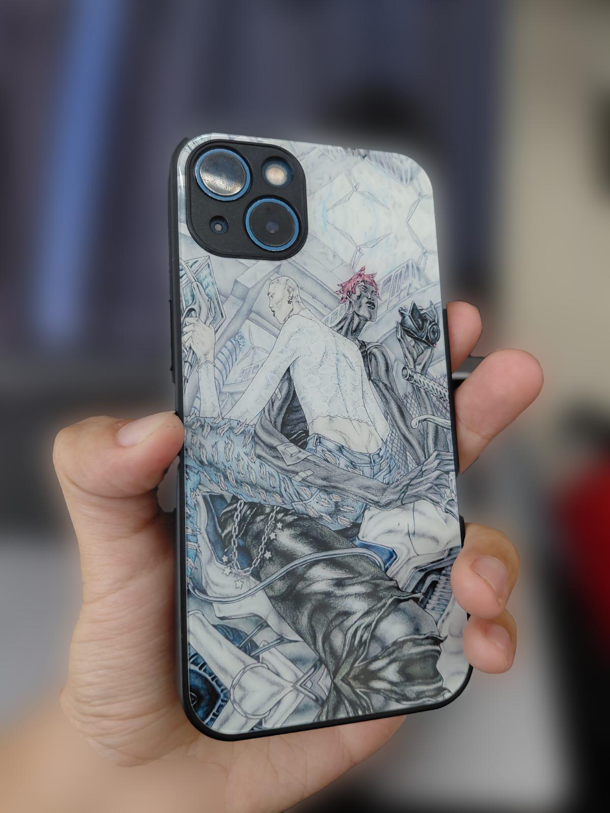
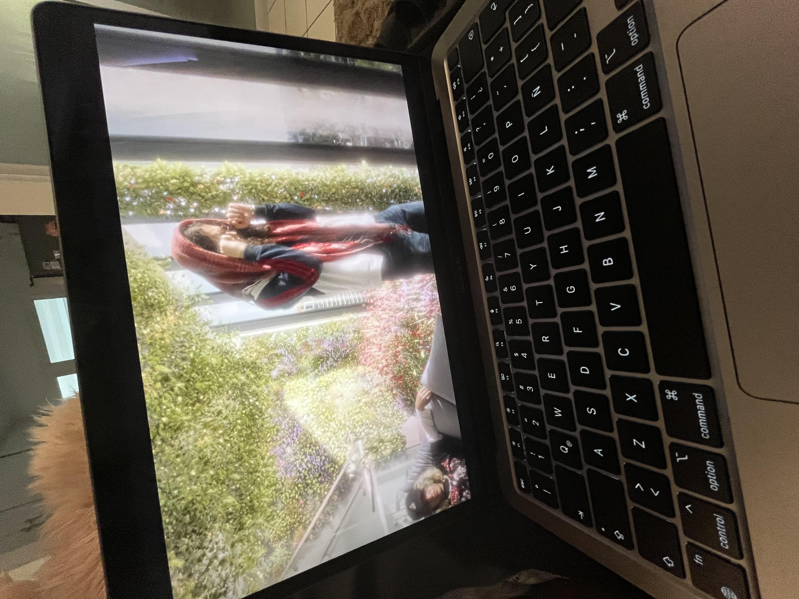
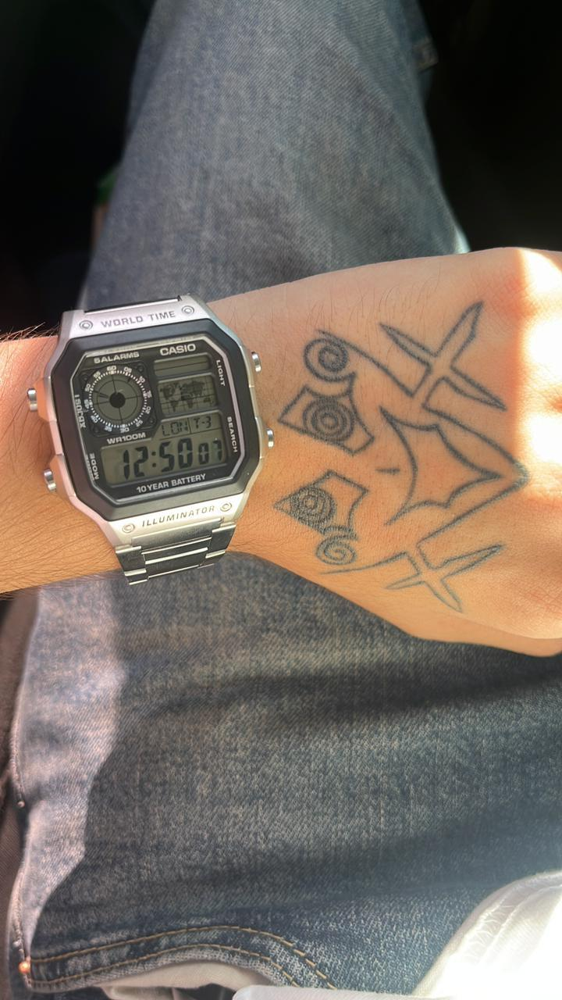
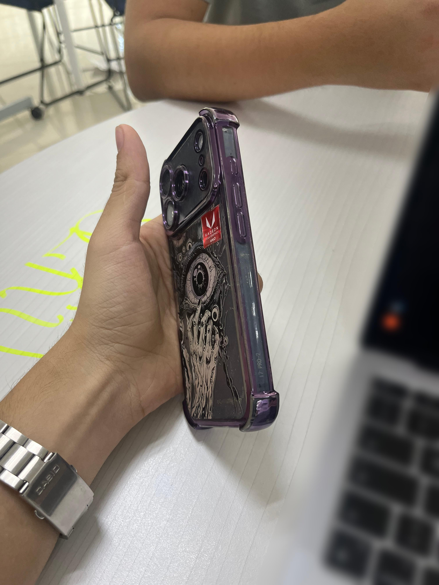
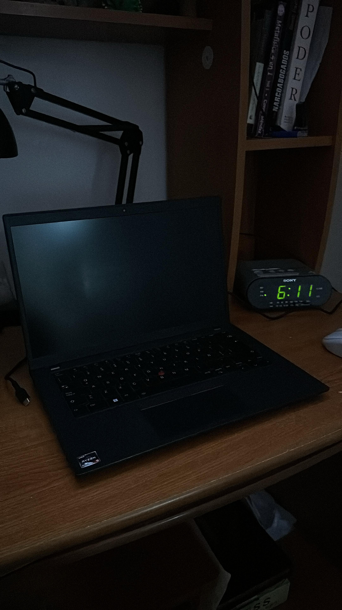
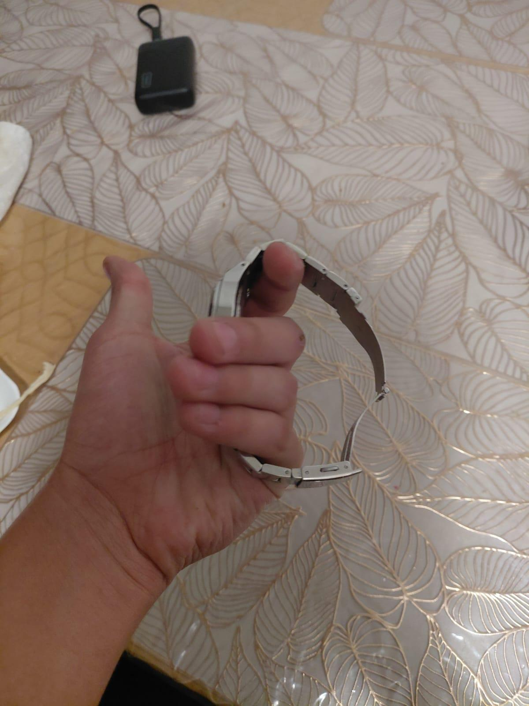
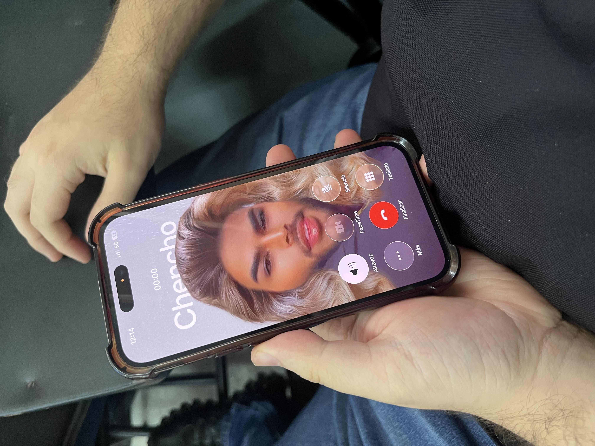
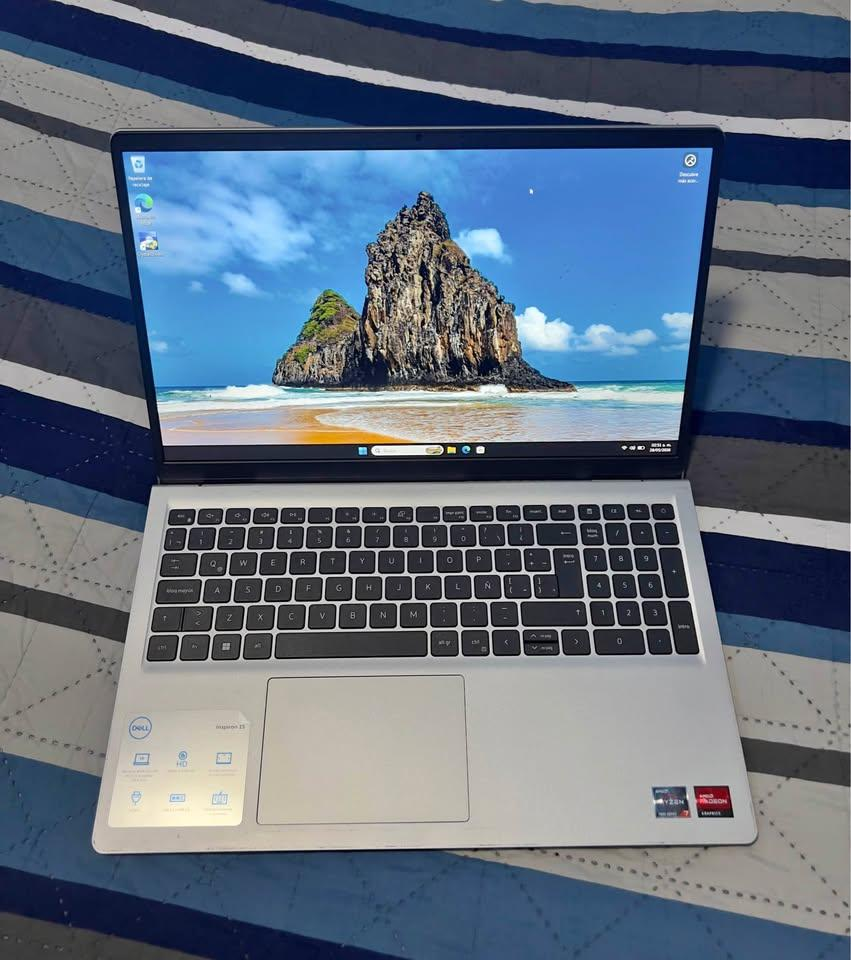
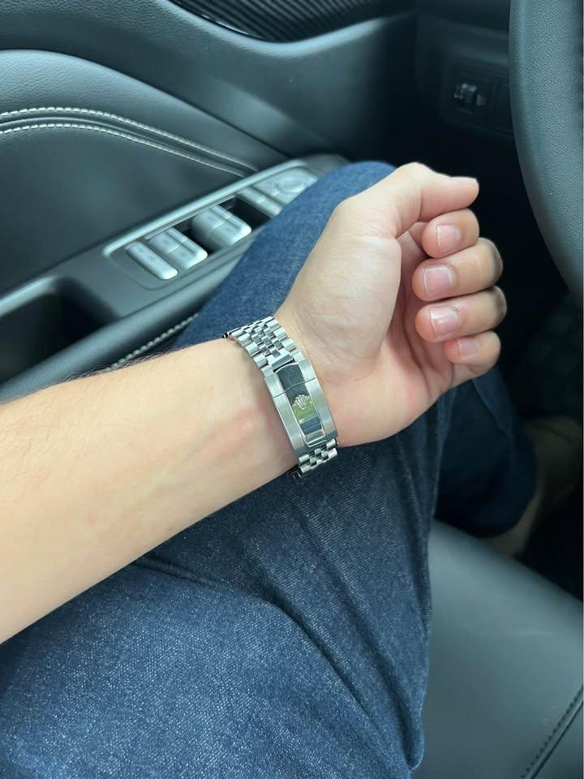

# clasificador de objetos con visión computacional

este repositorio contiene un sistema de inteligencia artificial básico entrenado para identificar celulares, laptops y relojes en tiempo real usando la cámara web. fue desarrollado como proyecto para mi curso académico de IA.

## cómo probar el script

se recomienda ampliamente usar un entorno virtual para no ensuciar la instalación global de python.

1. **crear y activar el entorno virtual:**
   ```bash
   python -m venv venv
   source venv/bin/activate  # en mac/linux
   venv\scripts\activate     # en windows
   ```

2. **instalar las dependencias:**
   ```bash
   pip install -r requirements.txt
   ```

3. **ejecutar el script de la cámara:**
   ```bash
   python 2_webcam.py
   ```

## cómo elegir el modelo

el script usa el modelo de transfer learning por defecto. en caso de querer probar el modelo que construimos desde cero, solo se abre el archivo `2_webcam.py` y se modifica la línea donde se carga el cerebro `.keras`:

```python
# para usar el modelo entrenado desde cero:
modelo = tf.keras.models.load_model('modelo_definitivo.keras')

# para usar el cerebro pre-entrenado de google:
modelo = tf.keras.models.load_model('modelo_transfer_learning.keras')
```

## sobre el desarrollo y las versiones

en el notebook `1_entrenamiento.ipynb`, el proceso está dividido en varias iteraciones. no se trata de código repetido, sino el proceso documentado de cómo se fue resolviendo el sobreajuste (overfitting) paso a paso:

* **modelo base:** la primera red neuronal. aprendió rápido pero desarrolló un sesgo grave hacia una sola clase.
* **modelo robusto:** se intentó asfixiar el sesgo inyectando mucha regularización (dropout al 50% y penalizaciones l2). la red colapsó y dejó de aprender.
* **modelo definitivo:** el punto de equilibrio. una arquitectura limpia con dropout moderado que logró estabilizar la predicción real sin memorizar los datos.
* **transfer learning:** el paso final. congelamos los pesos matemáticos de mobilenetv2 (google) y se puso nuestra propia capa de clasificación, logrando una precisión casi perfecta en pocos segundos.

## el dataset

nuestra base de datos consta de aproximadamente 75 fotografías caseras por cada objeto, capturadas en distintas condiciones de iluminación y ángulos para forzar a la red a extraer características geométricas. 

aquí una muestra de las imágenes con las que se alimentó al algoritmo:

| celulares | laptops | relojes |
| :---: | :---: | :---: |
|  |  |  |
|  |  |  |
|  |  |  |